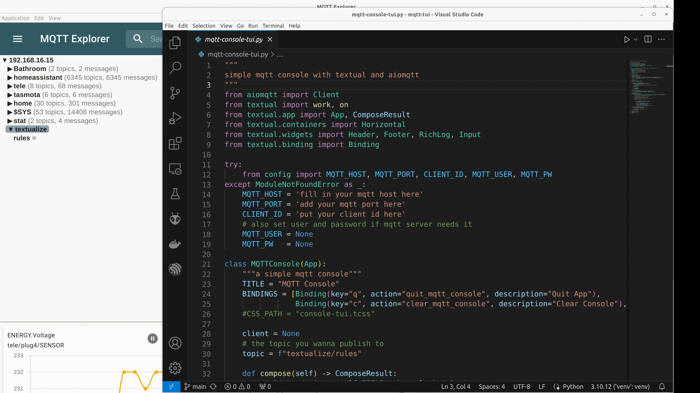

# mqtt-tui

This is a playground for [textualize](https://textual.textualize.io/) :heart: and [aiomqtt](https://github.com/sbtinstruments/aiomqtt) :sparkles: examples with focus on IOT stuff.  

## mqtt-console-tui.py

MQTT console tui for publishing to topics and it subrcibes to all (but you can filter the topics).    
main project here right now.  

## basic-mqtt-console-tui.py

A very basic example to show how subscribe and publish could work.  
Without all the clutter.  

## buttonizer.py

I try to make a graphical frontend for tasmota devices. (not working yet)

# Special thanks to

[nordwood867](https://github.com/norwood867) for pointing in the right direction.    

And ofc to all the [textualize](https://textual.textualize.io/) and [aiomqtt](https://github.com/sbtinstruments/aiomqtt) developers.  